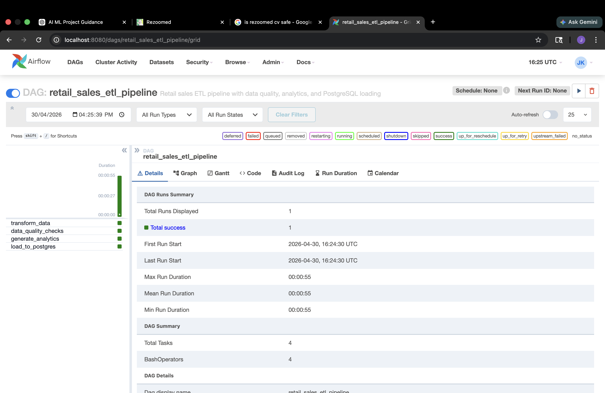

# 🚀 Retail Sales ETL Pipeline with Apache Airflow

This project demonstrates a complete end-to-end Data Engineering pipeline that processes retail transaction data, transforms it into meaningful insights, and automates the workflow using Apache Airflow.

The pipeline starts with raw retail data (Excel format), which is cleaned and transformed using Python (Pandas). Data quality checks are applied to ensure consistency and reliability, followed by analytics generation such as revenue trends, country-wise performance, and top-selling products. The processed data is then loaded into a PostgreSQL data warehouse, and the entire workflow is orchestrated using an Airflow DAG.

The architecture of the pipeline follows a structured flow:

Raw Data → Data Cleaning → Data Quality Checks → Analytics Generation → PostgreSQL → Airflow Automation

Technologies used in this project include Python (Pandas, SQLAlchemy), Apache Airflow, PostgreSQL, Docker, and SQL. The project is fully containerized and designed to reflect a production-style ETL workflow.

Below is the successful execution of the pipeline in Apache Airflow:

The project is organized into a modular structure where transformation, quality checks, analytics, and loading are handled through separate scripts. The Airflow DAG automates the execution in the following order:

transform_data → data_quality → analytics → load_to_postgres

The pipeline processes more than 500K records, removes invalid data, generates structured outputs, and prepares the data for further business analysis. The final outputs include cleaned datasets, analytics CSV files, and PostgreSQL tables that can be directly queried.

To run the project locally, Docker Compose is used to start PostgreSQL and Airflow services. After starting the containers, the Airflow UI can be accessed at:

http://localhost:8080

Once logged in, the DAG `retail_sales_etl_pipeline` can be triggered manually, and the execution can be monitored through the Graph View.

This project highlights practical skills in building scalable data pipelines, automating workflows, working with databases, and generating business insights from raw data.

---

**Author:** Jay Khakhar  
M.Sc. Artificial Intelligence (Germany)
